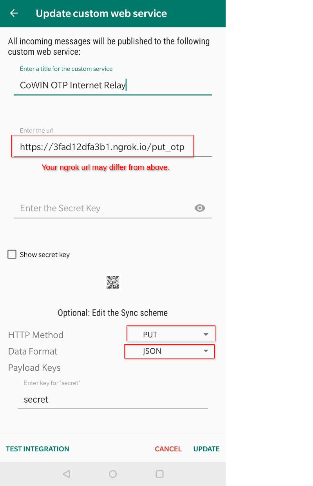
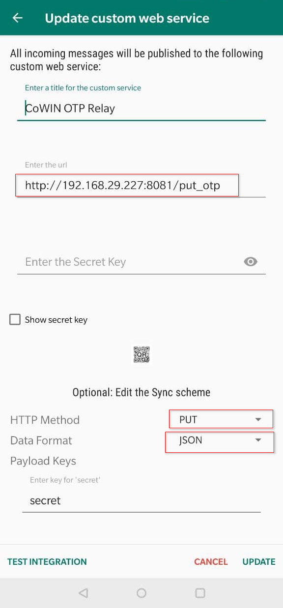
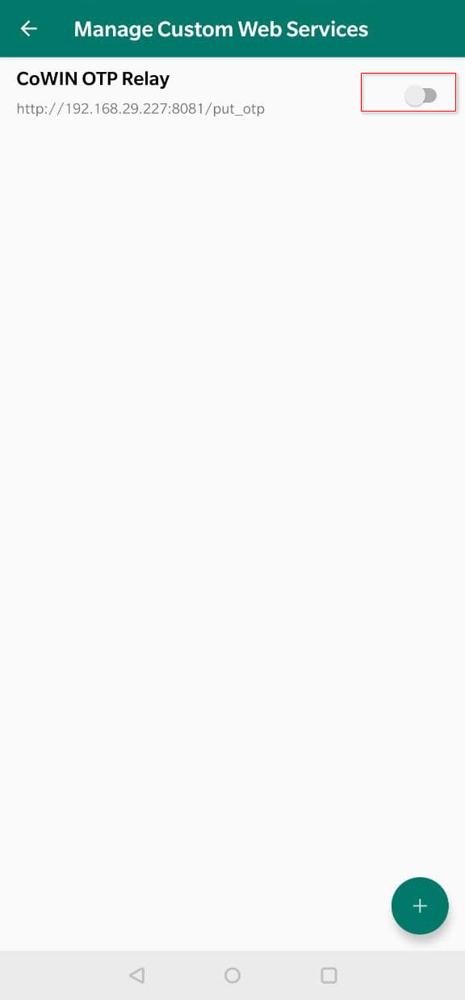
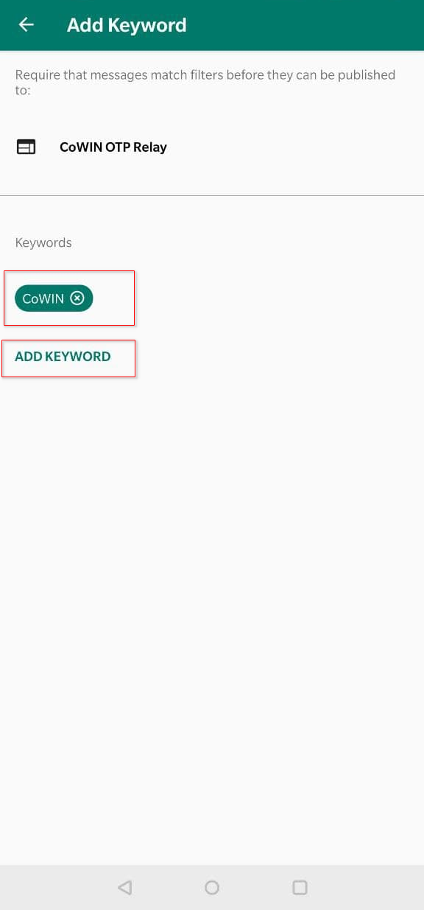
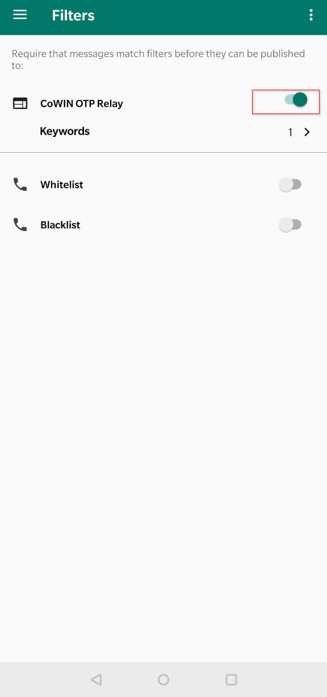
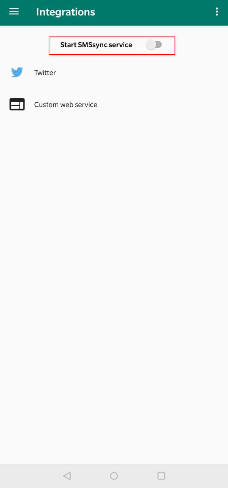
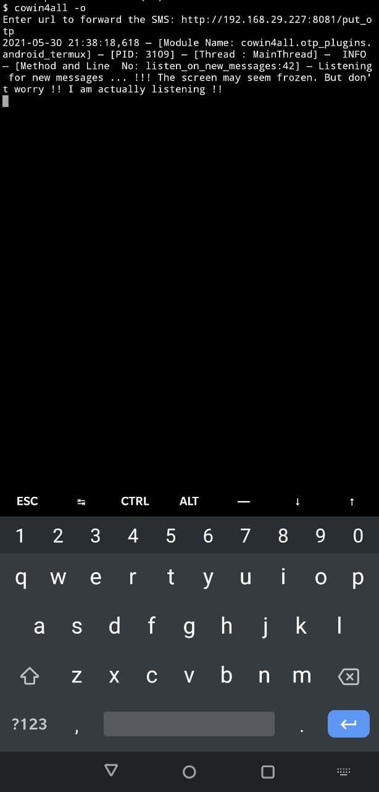
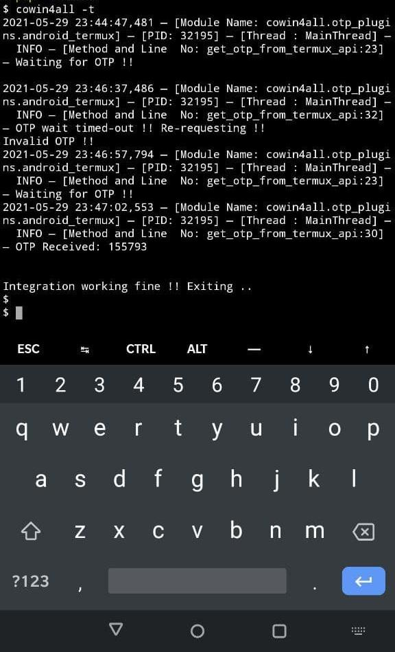

# cowin4All 

cowin4all is a framework to automate booking of vaccine slot in CoWin.

cowin4all SDK refers to the code present in `cowin4all/cown4all_sdk` folder. 
This is a generic SDK to interact with CoWIN portal with useful additional batteries / features. 
One may use it to write further automations.


cowin4all app (`cowin4all/app.py`) refers to booking automation app which uses this SDK for interaction with CoWIN site.

---

## 1. Motivation 

In the past few months , I had made multiple attempts to book a slot for myself, but I couldn't. I realised that 
many people were using automations to book their slots. I realised that I would stand no chance, if I were to book a 
slot manually. Hence, I wrote cowin4all for helping me to get a slot.


Post getting a slot, I understood the need for this tool to be open sourced. The play ground was not even.
There are people like me on one side who could write automations and book slots for themselves , while the other 
category of people do not even know what CoWIN is. 

Depending on one site for vaccination supply in an incomplete digitised country like ours across all class of 
people across various locations, is not justified in my humble opinion. 
There should be a better way to manage the vaccine supply. And I sincerely hope, Govt takes actions with regards to the 
same and brings in about a better method for vaccines to reach people safely and at the earliest.

Until then, I hope releasing cowin4all makes the playing field even and help more people in getting their vaccine shots. 
I also hope this is used in best of intentions by the users not just for personal benefits 
but also help more unprivileged people around to get the slot. 

During the course of writing this, I encountered various beautiful projects of similar nature (mentioned below), from which I have shamelessly copied some parts of code into this project. Refer the `Thanks to` section.

The complete README is written as non-technical as possible. However, there may be good chances  where I may have assumed a certain terminology being known to user. If you are unable to understand any section, feel free to raise an issue requesting clarification or better explanation.

We're all in this together.

---
## 2. How does it work ?

Before understanding the working of cowin4all, we need to understand the basic flow of CoWIN slot booking. Let's break it step by step.

* Step 1 : User visits the CoWIN Site.
* Step 2 : User enters the mobile number in the CoWIN Site
* Step 3 : CoWIN sends OTP to user.
* Step 4 : User enters the OTP Value and logs into the site.
* Step 5 : User keeps searching for available slot online for a given pin code or a given district in a state.
* Step 6 : Once a slot is available, user schedules appointment for a beneficiary.
* Step 7 : User enters the captcha. 
* Step 8 : The slot is booked.
* Step 9 : Follow step 5 to 8, in case booking needs to be done for other beneficiaries.
* Step 10 : In due course , if the session expires, start from step 2 to re-login to the site.


Now in this 10 step process, we need to understand where does one have an oppurtunity to win the race. Step 4, Step 5, Step 7, Step 9 and Step 10 are the places where a human would have to wait and provide the input. These are the major steps that any automation script tries to automate. Same is the case with cowin4all.


For automating Step 4, we need to have some listener sitting in our mobile which can forward the OTP soon as it receives. Lets call it OTP Forwarder. There are many types of apps which can forward SMS to an external site / app. Any of these apps can logically be used as OTP forwarder in cowin4all ecosystem.

All the remaining steps require interacting with CoWIN site directly, so lets call this automating entity as cowin4all app server for clarity.

Step 7 captcha input is automated through simple SVG analysis of the captcha with 100% success rate based on previous research. Refer the `Credits` section. 

Step 10 is implemented at SDK level which handles the auto refresh of token whenever 401 status code error is encountered while interacting with CoWIN.


Having understood the above , lets see a diagram detailing different types of setup cowin4all supports. 


### **Supported setups :-**

**Type 1 :** cowin4all app server with mobile OTP forwarder

In this setup, cowin4all app server runs a simple webhook service which can be accessed at port 8081. It exposes a single endpoint `put_otp` which can be used with `PUT` method. Any external app that has capability of forwarding the OTP can hit this endpoint with the complete SMS in any format. cowin4all api service reads the raw SMS and parses the OTP with regex. Hence the format of message is not considered. 

Apart from the webhook service, it also runs a separate thread which interacts with CoWIN site directly. 

Following are the two types of setup possible :-
~~~
 Option a : OTP forward over local network (i.e. within your home basic wifi network)
 
 In this cases webhook service is exposed to internal network alone.

 Option b : OTP forward over internet 

 In this case, webhook service is exposed over internet through a secure tunnel provided by ngrok.

 This is helpful if you are trying to book for people who may be in remote places with internet availability and may not be very aware of technology and booking of vaccines. I was able to help couple of old people in my native who were not well versed with technology, with this setup.  

~~~

**Type 2 :** cowin4all (all-in-one) setup 

~~~
This is applicable only to android. Also assumption being the number used for registration is same as the one being present inside the phone housing the setup. Any other scenario will not be applicable.
~~~
In this setup, cowin4all app houses both OTP listener for listening to incoming SMS and the main logic of interaction with CoWIN setup. 


Before you proceed to `Installation`, be clear on the type of setup you would want to establish else the below instruction would be overwhelming when looked as whole. Feel free to skip areas which does not matter for your setup. 

**Deciding which setup to go with ?**

* If you are helping a person who is remote, you should go with Type 1 Option a. This would require you to setup a cowin4all app server in your system (windows / linux / mac OS). You have to expose your cowin4all app server over ngrok to internet. And last, you need to install an OTP forwarder in the concerned person's mobile for whom you are booking the slot to send the OTP to your cowin4all app server. So this involves three steps. They are :-
  * Setup cowin4all app server in your Linux / Windows / Mac OS.
  * Setup the ngrok service in your system for exposing the app server to the internet
  * Setup an OTP forwarder app in the concerned person's mobile for whom booking is being done with ngrok url of the cowin4all app server so that OTP can be forwarded in the timely manner.


* If you are booking for a person who is within the same wifi network as yours, you can follow the same as above but can feel free to skip the step of setting up ngrok, since the person's mobile can directly forward the OTP to the cowin4all app server over your local network. So two steps in total. They are :-
  * Setup cowin4all app server in your Linux / Windows / Mac OS.
  * Setup an OTP forwarder app in the concerned person's mobile for whom booking is being done with url of the local cowin4all app server so that OTP can be forwarded in the timely manner.
  

* In case you would want to just get everything done with your android mobile , you may choose to go with cowin4all(all-in-one) setup. That would require only one step i.e. :-
  * Setup cowin4all in your android.  

---
## 3. Installation

I have kept the instructions as detailed and as lay man as possible to cover all types of users. The intention is to ensure user is fully aware of the requirements of this application and the changes being done to the system in which this would be run.

### 3.1 Pre-requisites

`Git` , `python3` and `pip` should be present as part of the system. If not , execute the below commands in your terminal or command prompt depending on your operating system.

`Git` is required for interacting with Github and downloading this project for installation.

`python3` (preferably python3.8 or above) is required to execute the application since this project is written in python.

`pip` is required to install the python library dependencies for this application.

Operating system specific instructions are provided below. Please follow the relevant instruction that applies to you. 

In case you would want to setup **Type 1 Option a** (OTP forward over internet). Follow the steps as detailed in your respective operating system setup in below sections. 

Over and above that, you may have to carry out one additional step of installing an app called `ngrok`. This will expose your cowin4all app's webhook service to internet which is required for remote mobile's OTP forwarder to forward the OTP.

Refer [here](https://dashboard.ngrok.com/get-started/setup) for setting up ngrok in your operaing system. 
Please note this is only applicable for non-android OSes. 


#### 3.1.1 Linux (Type 1 Setup - Refer Section `How does it Work?`)

1. **Ubuntu / Debian / aptitude package manager based systems**
   ~~~
   # Execute the below command in terminal

   apt-get install python3-dev python3-pip git
   ~~~

2. **CentOS / Debian / yum package manager based systems**

   ~~~
   # Execute the below command in terminal
   
   yum install python38-devel.x86_64 git -y
   ~~~

&nbsp; ***Note:***

    If you use any other Linux distro , then I assume you would know better than me on how to get this installed in that distro. :P


#### 3.1.2 Mac OS (Type 1 Setup - Refer Section `How does it Work?`)


You would need `brew` to be installed before you carry out further steps.`brew` is an unofficial package manager for 
mac os. It helps in installing various packages over command line without having to search online.

Refer [this link](https://brew.sh/) here for installation steps. 


After having installed `brew`, execute the commands below in your terminal. Feel free to ignore any of the below commands, if you 
have the concerned dependency already installed in your system


```bash
brew install python3 # To install python3
curl https://bootstrap.pypa.io/get-pip.py -o get-pip.py  # To install pip
python3 get-pip.py   
rm get-pip.py  # Remove the pip installer script
```

#### 3.1.3 Windows (Type 1 Setup - Refer Section `How does it Work?`)

You would need `chocolatey` to be installed before you carry out further steps.`chocolatey` is an unofficial package 
manager for windows. It helps in installing various packages over command line without having to search online.

Refer [this link](https://chocolatey.org/install#individual) here for installation steps. There are multiple ways
to install chocolatey. Choose the one that suits you.

After having installed `chocolatey`, execute the commands below. Feel free to ignore any of the below commands, if you 
have the concerned dependency already installed in your system

Open command prompt and execute the below command. (Search for "command prompt" in windows search bar)

```commandline
choco install python3 git  
python3 -m pip install -U pip
```

#### 3.1.4 Android (Type 1 / 2 Setup - Refer Section `How does it Work?`)

*Note:*

~~~
Android based setup can be used as all-in-one setup or just as an OTP forwarder. If you are planning to setup the android phone in either of the type, please follow all the steps detailed below. These steps below are common for both modes. The difference is only in the way on how they are executed.
~~~

You would need `termux` app and `termux-api` to be installed before you carry out further steps. `termux` is an app that
provides terminal interface in android. 
Installing this helps in  accommodating apps that may not be UI driven and are compatible with Linux such as this to run comfortably in an android environment.

**i.**  Installing `termux`

* Go [here](https://f-droid.org/packages/com.termux/), download the apk and install the `termux` app. 

*Note:* 

~~~
You may have to enable "Install from unknown sources" setting in your phone. This is necessary because Google developed 
android OS (which is the OS used by majority of the phones), does not allow installation of app outside Google play. This setting differs from one phone to other. Hence there is no standard instruction for this. Kindly google for "How Tos" for your model and enable this relaxation.

The latest version of above app is not available in google play and hence this requirement.
~~~

**ii.** Installing `termux-api`

***Step 1 :*** Install the Android App

~~~
This is required to interact with phone features such as reading SMS in our case. Our python script will use this 
to read OTP from phone directly.
~~~
* Go [here](https://f-droid.org/packages/com.termux.api/), download the apk and install the `termux-api` app.

***Step 2:*** Installing the termux-api cli command

* Open your installed `termux` app . You will be welcomed with a terminal.
   
* Execute  `apt install termux-api` . 

*Note:*
~~~
Refer https://wiki.termux.com/wiki for additional details on termux and termux-api. 
~~~

**iii.** Installing other pre-requisites for cowin4all

* Go to termux app and execute the following command.
  
      apt install python git -y


*Note:*

~~~
Ensure you disable settign pertaining to install from unknown source in your android phone once the above apps are installed as security hygiene.
~~~


### 3.2 Installing cowin4all (applicable to all operating system)

Please ensure you have installed all the pre-requisites as detailed in `3.1` for your OS before following this section. Below are various options to install cowin4all.

**Option -1** Installing directly from github

 Execute the below command in terminal / command prompt (depending on your operating system)

      pip3 install git+https://github.com/rams3sh/cowin4all.git  # try replacing pip3 with pip in case of any errors`

**Option -2** Installing directly PyPI (Python package registry)

Execute the below command in terminal / command prompt (depending on your operating system)

      pip3 install cowin4all  # try replacing pip3 with pip in case of any errors`

**Option -3** Building / Installing from source
      
      I would comfortably assume you as user choosing this option would know how to take this ahead from here. :) 

---
## 4. Usage


### 4.1. As SDK

Ignore this section, if you are not planning to use cowin4all for developing your automations.

Refer the `cowin4all/app.py` for usage reference.

The code base is written as modular as possible so as to support multiple types of otp retrieval and captcha solving mechanism. One may refer the `otp_plugins` and `captcha_plugins` folder to understand how a custom retrieval plugin can be written.

Some ideas I have thought about but never implemented are following which user can probably try out.

* Telegram bot which can take captcha input from user during the course of run. 
* Implement kvdb as OTP store and write a OTP retrieval plugin just as how [bombardier-gif](https://github.com/bombardier-gif/covid-vaccine-booking) has implemented it.
*  

### 4.2. As app 


**Step 1 :** Ensure you have registered the beneficiaries in CoWIN portal before you use this project.

**Step 2 :** Enter the booking detais.

Execute the following command in your respective OS's terminal and enter the details.

    cowin4all -e

**Step 3 :** 

In case, you would want to go with **Type 1 Option a** (OTP forward over internet) setup, you have to run ngrok before proceeding to next step. Else skip this step. Assuming you have downloaded and installed ngrok and ngrok is in same location where your terminal / command prompt is pointing to, execute the below command :-

**Linux / MacOS**

   ```./ngrok http 8081```
 
**Windows**

   ```.\ngrok.exe http 8081```

~~~
Note down the url of ngrok that is displayed in your terminal. It should be of pattern https://<something>.ngrok.io. Avoid http and consider only https version of ngrok url. This ensures that OTP is forwarded securely over internet.
~~~

*Note:*
~~~
If you exit the ngrok or shut down or restart the system, this url will change and you may have to modify the url in your respective OTP forwarder app again.  
~~~

**Step 4 :** 

In case, you would want to go with **Type 1 Option b** (OTP forward over local network) setup, note down the IP of your system that is reachable from your phone. In majority of the cases, it should be of format `192.168.X.X`. Refer [this article](https://www.avast.com/c-how-to-find-ip-address) for identifying local area network IP of your system. In case you are using linux which the article does not cover, I would safely assume you as a user know how to find the IP.


**Step 5 :** 

After having entered the booking details, we need to ensure we have some app that can forward OTP from our phone to cowin4all. Ignore this step and skip to step-6, if you have chosen to install cowin4all all-in-one setup in android, since in that case, we do not require separate OTP forwarder as cowin4all installed in the mobile by default has access to the SMS being received in your phone.


**A. Installing OTP Forwarder to cowin4all in Android Phones**

**Option -1** Using SMSSync App as OTP Forwarder

 1. Install the [SMSSync App](https://play.google.com/store/apps/details?id=org.addhen.smssync&hl=en_IN&gl=US) from play store and set the app as default SMS app. 

 2. Go to `Integration > Custom Web Service > (+)` - Create a new custom web service integration

3. Below are two images detailing setup in case of local lan based setup and internet based setup.
4. The red highlighted box are the changes to be configured.
    * Internet based OTP forward configuration (**For Type 1 Option a Setup**)

      
    
    * Local Network (Non-Internet) based OTP forward configuration  (**For Type 1 Option b Setup**) 
    
       Replace the below string with the IP identified as part of Step 4 above.
      
      `http://<your system ip>:8081/put_otp`
      
      

5. Press Update
6. Enable the integration (Switch it On)
      
   

7. Go to `Filters > CoWIN OTP Relay` (or to whichever name you have kept for the integration service) and add "CoWIN" as keyword filter. This will reduce non COWIN SMS from getting sent to your API service.

   


8. Enable the keyword filter.

   

9.  Enable the SMSSync Service

   


Now that the service is running, the app will start forwarding all SMS having "CoWIN" keyword to the configured endpoint.

*Note:-*

~~~
SMSSync has not been updated in a long while and it may probably show warning saying app is developed for older version. However, it has been found to be working across most of the modern android phones I have tested. 

Also the app is little buggy, sometimes keywords filter may not work and the app may end up sending all messages. There are also issues where app gets stuck. 

In these scenarios, try to disable the service, then disable the integration service and enable them in the reverse order.

If it does not work, try restarting the mobile once and follow the above steps again.  This does not happen frequently, but these has been observed a few times by me.
~~~
**Option -2** Using cowin4all as OTP forwarder

This requires installation of cowin4all in the phone. Follow all the steps as detailed in Section `3.1.4` and `3.2`. 

Run the below command in `termux`.

```
cowin4all -o 
```
When asked for url, enter the ngrok url / the local network url to forward the OTP as same as how it is done in case of SMSSync. Sample screenshot from termux below.




**Other Options**

There are other options such as IFTTT which can carry out the same as the above two. Logically they should work well with cowin4all as long as the url of the cowin4all app server and the method i.e. `PUT` method is configured for forwarding the OTP. 

**B. Installing OTP Forwarder to cowin4all in iOS Phones**
 
**Option 1** Using shortcuts app

This has not been tested, but it will logically work. One can refer detailed documentation in bombarider-gif's project. 

Link [here](https://github.com/bombardier-gif/covid-vaccine-booking#shortcuts-steps-in-screenshots).

Just ensure that the url entered in the configuration is that of the cowin4all server app and the method is `PUT`.

*Note:* 
~~~
cowin4all setup with iOS is not completely automated as mentioned in the above mentioned link, since iOS does not allow non-interventional forwards of SMS. User is required to tap before forwarding the SMS. However, this is at least faster than typing out the OTP manually.
~~~

**Step 6 :** 

Test the cowin4all app server / cowin4all (all-in-one) mode for the OTP forwarder integration.
Execute the below command in your respective OS's terminal.

```
cowin4all -t 
```

If OTP forwarder in case of non all-in-one setup / installation of required termux libraries in case all-in-one setup has been carried out properly, one would get SMS Integration. Below is a sample screenshot from Android termux.



The app will stop on successful receipt of OTP from the forwarder.

Once you see note that the integration is working fine, now the app is ready to be run.

**Step 7:**

Execute the below command in your respective OS's terminal to start the auto booking app.

```
cowin4all # as simple as that :)
```


That was a big read right !!! Now you can grab a coffee and wait for the slot to be booked. 

Once the slot is booked, the pdf of the appointment confirmation will be saved in the same location from where cowin4all is run.

## 4. How can CoWIN be protected from these types of tools / bots?

Following are some signatures of the automated tools  , I have encountered so far during my review and analysis. Also documented some of the mechanisms that can be improved in CoWIN to prevent such bots.

1. Majority of the scripts use a hard coded secret for generation of OTP such as [this](https://github.com/rams3sh/cowin4all/blob/b9dc3f4fd0331682a019744d95725ecf72282013/cowin4all/cowin4all_sdk/constants.py#L37) from this project. Rules can be setup at the WAF or at applciation layer to block / throttle the requests pertaining to requesition of OTP wherever similar hard coded secrets are identified as part of POST payload for more than a given threshold. I have observed in my limited analysis that the secret generated for sending along with generate OTP request is mostly same across for all users and hence the developers os such bots / scripts use this as hardcoded secret into their script. Though I dont understand with my limited knowledge on what would be the significance of generating such static secret that would required to be sent through the request, but I can assume that the developer(s) of CoWIN would have wanted to distinguish browser from a bot assuming the secret would be generated by the javascript once executed under the context of the browser which a bot cant. But unfortunately, thats not the case. 


   Some of the example references from similar projects supporting the above statement below :-
      
      * https://github.com/anoop142/cowin-cli/blob/320ad51fe1232a32bb6af75c3684ac2f199442af/cowin/otp.go#L24
      * https://github.com/truroshan/CoWin-Termux/blob/56314dfc277eeab743361e723103d7470ae14807/cowin.py#L151
      * https://github.com/rayarindam2111/Co-WIN-automated-slot-booking/blob/50b928d270bc8474db3029981300295c6ffdd3f1/public/umang-cowin.js#L332
      * https://github.com/suraj-deshmukh/CoWin-Vaccine-Slot-Monitoring-and-Auto-Booking/blob/939dda05621f758b46eb7f62c1996c9a38a53f37/utils.py#L13


2. Its better not to provide captcha in an SVG format or any format that can be directly analysed based on just identifying the patterns of the paths for rendering the captcha.  More on how CoWIN's captcha was solved could be inferred from the issue [here](https://github.com/skotz/cbl-js/issues/65) . One can refer the logic of analysing the captcha format and determining the captcha text from the file at  `cowin4all/captcha_plugins/svg_pattern_analysis.py`. 
   
   This defies the basic purpose of having captcha in the first place which is to differentiate humans from bots. Stronger and novel the captcha , better the prevention of bots. One can use somthing like Google's reCaptcha to have a better chance at stopping bots. This would not totally solve the problem, because there are ways to crack it, but at the least it will cut down good dozen of bots from hitting the site. 

3. Based on observation of response pertaining to request blocked , there is a high chance that CoWIN may be completely run from AWS since the requests had cloudfront signature in it. There are services in AWS which can also help in preventing bots to some extent such as [this](https://aws.amazon.com/waf/features/bot-control/). Though I cannot personally vouch for effectiveness of it, but atleast it claims to prevent bots in the article.  


Practically , implementing some of the recommendations mentioned above would bring down usability. But at the end of the day it's always a tradeoff between security and usability. Finding the right balance is always the biggest challenge.

All the above being said, CoWIN site being one of the major choke point of vaccine supply in a country like ours where majority of the people are yet to be exposed to technology is something I dont feel justified. There are good number of people who do not even know what CoWIN is. 

I am not expert in the field , hence I would leave it at that comment. 

*Note:*

      This section will be updated as and when I encounter any new pattern or any element that can be used to detect or prevent bots accessing the CoWIN Site.


## 5. Thanks to

I have borrowed  ideas from various projects to make cowin4all more robust. Following are the users and their projects from where I borrowed some ideas.

1. [ushahidi](https://github.com/ushahidi/SMSSync/) for the wonderful SMS gateway app.

   
2. [pallupz](https://github.com/pallupz/covid-vaccine-booking) - The idea of getting details from user through `tabulate` package came from this project.
   
3. [bombardier-gif](https://github.com/bombardier-gif/covid-vaccine-booking) - Initial idea of having SMS being sent over webhook came from this project. Many ideas pertaining to wait times have been shamelessly borrowed from this project.


4. [ayushchd](https://github.com/ayushchd) - For analysis of captcha patterns and making a model for breaking the captcha.


5. [truroshan](https://github.com/truroshan/CoWin-Termux) - Idea of porting cowin4all to an android based setup came from this project. 


## 6. Other similar projects that you should check

1. https://chrome.google.com/webstore/detail/covid-vaccine-slot-checke/hmmahfccoaoebmjhmcnbbomomkimomhi?hl=en

2. https://chrome.google.com/webstore/detail/cowin-bot/ipdhilmkmmbfeilncgchfdabkpnhbeog


3. https://github.com/anoop142/cowin-cli
   
4. https://github.com/rayarindam2111/Co-WIN-automated-slot-booking/


## 7. Please donate and help others

If you like this project, consider donating to [TN CM Public Relief Fund](https://ereceipt.tn.gov.in/Cmprf/Cmprf) or any other CM / PM fund.


## 8. License

Please feel free to use the code the way you would want to , as long as it benefits all. Use it responsibly.


## 9. Disclaimer

This has been released with good intentions of helping all in getting equal chances at booking slots in CoWIn. 

Use it at your own risk. author assumes no responsibility or liability in case of illegitimate use of this code.