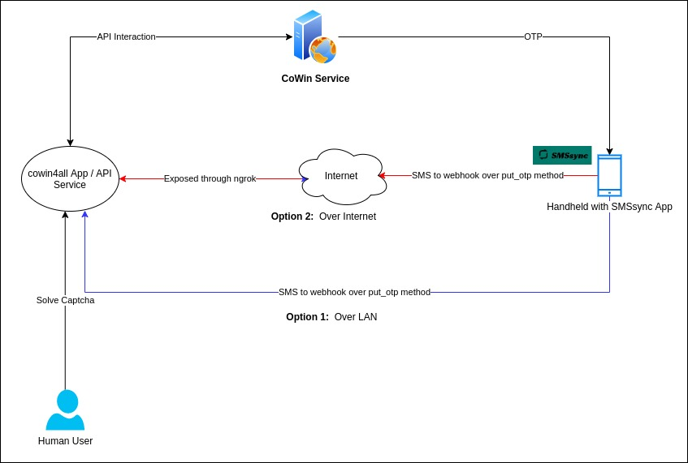
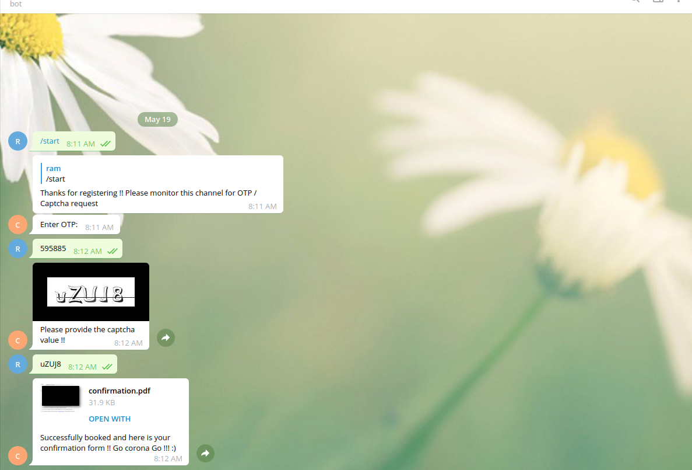

# cowin4All 

cowin4all SDK / app to automate booking of vaccine slot in CoWin.

cowin4all SDK refers to the code present in `lib/` folder. This is a generic SDK to interact with CoWIN portal with useful 
additional batteries / features. 

cowin4all app (`cowin4all_app.py`) refers to booking automation app using this SDK.


## 1. Background 

I have been trying to book a slot for myself for more than a month, but I couldn't get to reserve even one slot.

Thus the birth of cowin4all. 

cowin4all was primarily focussed to be written as an SDK first and then as an automation app.
There has been lot of automations written by people all around which does not allow any one to book slots for themselves.

I hope releasing cowin4all as an SDK will make the playing ground more even. 

My only request to the consumer of this app is to help not so tech savvy / non-provileged 
people like your servant / maid / watch(men|women)  etc. in getting their slots for vaccination by adding them as 
beneficiaries in your account. 

We're all in this together.

## 2. cowin4all SDK 

### 2.1 Setup
1. Clone this repo and traverse to the code directory
    ```shell
   git clone git@github.com:rams3sh/cowin4all.git && cd cowin4all
   ```
   
2. Create a virtual environment
    ```shell
    python3 -m virtualenv env
    ````
3. Activate the virtual environment 
    ```shell
   source env/bin/activate  
   ```

4. Install the package requirements
   ```shell
   pip3 install -r requirements.txt
   ```

### 2.2. Usage

Refer the `cowin4all_app.py` for reference

### 2.3. Pluggable custom OTP retrieval method

This code base supports external pluggable otp_retrieval_method. 
This is to support various OTP retrieval mechanisms.

One possible method is to install an app in your phone that can forward relevant SMS to a webhook 
and the webhook can feed the OTP back in your code workflow. Below pseduo-snippet based on FastAPI library should 
give an idea on how this can be achieved.

```python
def otp_alert(sleep=10):
    global otp_alert_running, otp

    def wait_and_alert():
        global otp_alert_running
        logger.info("Waiting for alerting the user for OTP in case not received !!")
        time.sleep(10)
        if otp:
            otp_alert_running = False
            return
        else:
            play_sound("resources/refresh_OTP.mp3")

    if not otp_alert_running:
        otp_alert_running = True
        alert = Thread(target=wait_and_alert, daemon=True)
        alert.start()
    else:
        return
    
def get_otp(client=None):
    global otp_wait, otp, logger
    otp = None
    logger.info("Waiting for OTP !! ")
    otp_alert(sleep=10)
    otp_wait.wait()  # Waited for SMS to be hit on below webhook
    otp_wait.clear()
    logger.info("OTP Received: "+str(otp))
    return otp

@app.put("/put_otp")
async def put_otp(request: Request):
    global otp_wait, otp
    body = await request.json()
    logger.info("Received SMS: " + str(body))
    if body["from"] == "AX-NHPSMS":
        match = re.findall("(?<=CoWIN is )[0-9]{6}", body["message"])
        if match:
            otp = match[0]
            otp_wait.set()

client = APIClient(mobile_no=mobile_number, 
                   otp_retrieval_method=get_otp,  # Custom OTP method
                   auto_refresh_token=True, # This ensures the token is auto-refreshed once token expires
                   auto_refresh_retries_count=3)


```
The above snippet is from my internal setup which uses app from [ushahidi](https://github.com/ushahidi/SMSSync/) for 
forwarding SMS from phone to the `put_otp` endpoint

One can setup a simple web server and expose it to public / local network and configure the above mentioned app to 
forward the SMS from CoWIN to the hosted web api. This ensures that OTP gets automatically fed without much effort.

This idea was inspired from the earlier code open sourced by [bombardier-gif](https://github.com/bombardier-gif/covid-vaccine-booking) 
where IFTTT was used as SMS relaying medium.

There can be various methods in terms of how an input can be retrieved. 

For example, one can have a telegram bot which can alert the user when token expires and OTP can be fed to a telegram bot 
by the user manually and bot in turn can feed it back to the workflow. 
Similar scenarios / methods can be considered for  handling captchas as well, where captcha can be sent by telegram 
bot to the concerned user and user can type in the captcha to telegram based bot resulting in it getting fed into the workflow.

The captcha solving can be overcome , if a captcha breaking algorithm can be integrated. 
There are good amount of code base out there which could be fine-tuned and used, but since I didn't have much 
understanding of it, I left it as is. 

Further, commonly used methods are part of `utils.py` such as `get_otp_manually`, `get_captcha_input_manually`. You may either use them
or write your own custom retrieval method to get from user and feed back to your logic. 


## 3. cowin4all App

I wrote a little hacky app `cowin4all_app.py` using the cowin4all SDK with the setup as mentioned in the below diagram. 




[ngrok](https://dashboard.ngrok.com/get-started/setup) was used for exposing my internal API Service endpoint to the internet
in case I had to book slots for my friends.

### 3.1 Beneficiary Registration 

1. You are required to register the beneficiary in the CoWIN portal.
2. Once the registration is done, follow further steps stated below.

### 3.1. SMSSync Setup 

1. Install the SMSSync App and set the app as default SMS app. 


2. Go to `Integration > Custom Web Service > (+)` - Create a new custom web service integration


3. Below are two images detailing setup in case of local lan based setup and internet based setup.
   The red highlighted box are the changes to be configured.
   

   * **Option 1 . LAN based configuration**  
      Find the IP of the system where you are going to run the app and modify it accordingly. 
     My system's IP was `192.168.29.227`. Hence it's appearance in the url in the below screenshot.
     


   * **Option 2 . Internet based configuration**
     


4. Update the configuration. 


5. Enable the integration.

   

6. Go to `Filters > CoWIN OTP Relay` (or to whichever name you have kept for the integration service) and add "CoWIN" 
   as keyword filter. This will reduce non COWIN SMS from getting sent to your API service.

   


7. Enable the keyword filter.

   

8. Enable the SMSSync Service

   


Now that the service is running, the app will start forwarding all SMS having "CoWIN" keyword to 
the configured endpoint.

### 3.2 cowin4all App Setup


1. Modify the requirements.txt by uncommenting the packages pertaining to `uvicorn` and `fastapi`. 

   
2. Install the requirements as mentioned in section `2.1` point 3.


3. Since the cowin4all app at current state works based on hardcoded beneficiary information, you may have to modify
the code a little. Search for `####### BEFECIARY BOOKING DETAILS #######` and fill up the relevant information. 
   

5. Once that is done, you can run the app using below command. 
`uvicorn cowin4all_app:app --port 8081 --host 0.0.0.0`
   

6. If you are planning to expose the app over internet through ngrok. You may have to additionally execute 
   the below command
`ngrok http 8081`


**Note:**

   Please note , you may have to install [VLC](https://www.videolan.org/) over and above the mentioned packages for 
   playing alert sound. I couldn't find any platform agnostic python packages that can play sound, hence relied on VLC
   which was already part of my system.

   The cowin4all app has been tested in Linux. It should work well with other OSes as well. 

   The captcha has to be entered manually handling the cowin4all app. This is not automated yet. 
   This could be however sent through a telegram bot and the captcha can be requested from the user. 
   This will remove dependency on the user to sit before the system until booking confirmation. 
   I have been working on this. 
   
A sample screenshot below :- 
  

   

## 4. Thanks to

1. [ushahidi](https://github.com/ushahidi/SMSSync/) for the wonderful SMS gateway app. 
   This is way more efficient than IFTTT in terms of customisation. Also good part is , it is open source.

   
2. Couple of people who worked on earlier version of automation of various cowin booking apps.

    i. [pallupz](https://github.com/pallupz/covid-vaccine-booking) - The `get_captcha_input_manually` method has been 
   shamelessy copied from pallupz's code base. 
   
   ii. [bombardier-gif](https://github.com/bombardier-gif/covid-vaccine-booking) - The idea of forwarding SMS from the phone to
   webhook came from bombardier-gif's code base. However I found IFTTT not feasible because it requires payment for immediate SMS forward, 
   free version delays the sending of SMS to webhook. This is what led me to search for open source alternative leading to find 
   SMSSync app by [ushahidi](https://github.com/ushahidi/SMSSync/). Also bombarider-gif's code base had lot of moving parts. 
   The SMS gets stored in an external key-value DB store kvdb.io and the python script has to poll the kvdb continously 
   for retrieving the OTP. These have resource and IO cost. This led me to create my app with API endpoint to be hit
   by an external SMS relayer directly instead of using any intermediate storage.


3. Audio Sources  
   * soundbible.com for `resources/Siren-SoundBible.com-1094437108.mp3` . Link [here](https://soundbible.com/1233-Siren.html).
   * [voiceover](https://voicemaker.in) - for `resources/refresh_OTP.mp3` . Sound generated using `Neural TTS` AI Engine 
     with voice of `Kimberly, Female` with text `refresh OTP`.

## 5. TODO

1. Detailed non technical user friendly README.
2. Easy installation script.
3. Telegram Bot Integration


## 6. Please donate

If you like this project, consider donating to [TN CM Public Relief Fund](https://ereceipt.tn.gov.in/Cmprf/Cmprf)

## 7. License

Please feel free to use the code the way you would want to , as long as it benefits all. Use it responsibly.

## Disclaimer

This has been released with good intentions of helping all in getting equal chances at booking slots in CoWIn. 

There are enough automations already which does not give opportunity for others to book slots. 

In times , like these we are supposed to help each other and I hope this helps lot of people.

Use it at your own risk. author assumes no responsibility or liability in case of illegitimate use of this code.
