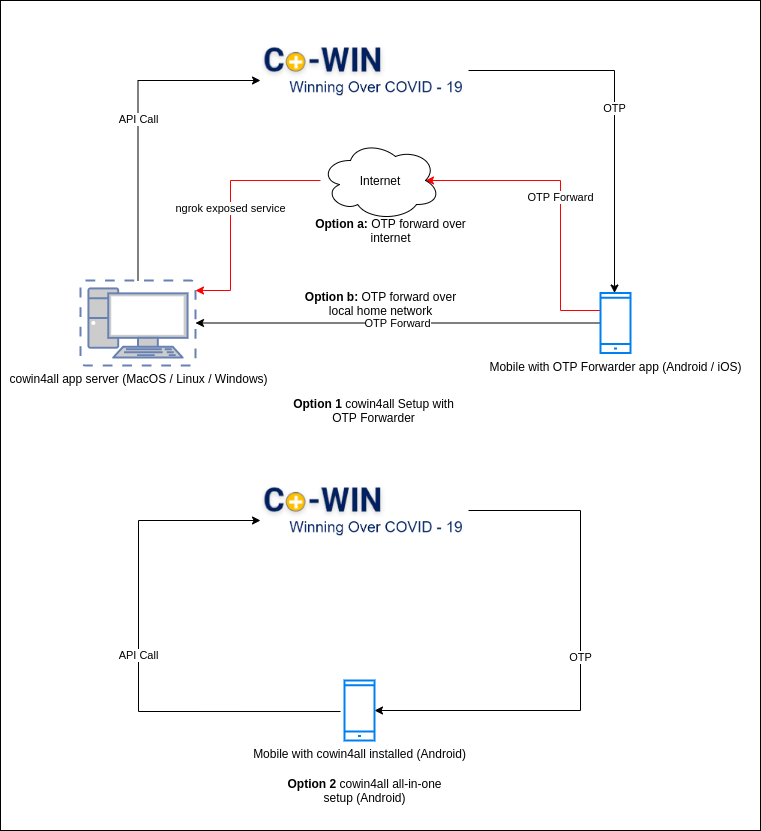

# cowin4All 

cowin4all is a framework to automate booking of vaccine slot in CoWin.

cowin4all SDK refers to the code present in `cowin4all/cown4all_sdk` folder. 
This is a generic SDK to interact with CoWIN portal with useful additional batteries / features. 
One may use it to write further automations.


cowin4all app (`cowin4all/app.py`) refers to booking automation app which uses this SDK for interaction with CoWIN site.

---

## 1. Motivation 

In the past few months , I had made multiple attempts to book a slot for myself, but I couldn't. I realised that 
many people were using automations to book their slots. I realised that I would stand no chance, if I were to book a 
slot manually. Hence, I wrote cowin4all for helping me to get a slot.


Post getting a slot, I understood the need for this tool to be open sourced. The play ground was not even.
There are people like me on one side who could write automations and book slots for themselves , while the other 
category of people do not even know what CoWIN is. 

Depending on one site for vaccination supply in an incomplete digitised country like ours across all class of 
people across various locations, is not justified in my humble opinion. 
There should be a better way to manage the vaccine supply. And I sincerely hope, Govt takes actions with regards to the 
same and brings in about a better method for vaccines to reach people safely and at the earliest.

Until then, I hope releasing cowin4all makes the playing field even and help more people in getting their vaccine shots. 
I also hope this is used in best of intentions by the users not just for personal benefits 
but also help more unprivileged people around to get the slot. 

During the course of writing this, I encountered various beautiful projects of similar nature (mentioned below), from which I have shamelessly copied some parts of code into this project. Refer the `Thanks to` section.

The complete README is written as non-technical as possible. However, there may be good chances  where I may have assumed a certain terminology being known to user. If you are unable to understand any section, feel free to raise an issue requesting clarification or better explanation.

We're all in this together.

---
## 2. How does it work ?

Before understanding the working of cowin4all, we need to understand the basic flow of CoWIN slot booking. Let's break it step by step.

* Step 1 : User visits the CoWIN Site.
* Step 2 : User enters the mobile number in the CoWIN Site
* Step 3 : CoWIN sends OTP to user.
* Step 4 : User enters the OTP Value and logs into the site.
* Step 5 : User keeps searching for available slot online for a given pin code or a given district in a state.
* Step 6 : Once a slot is available, user schedules appointment for a beneficiary.
* Step 7 : User enters the captcha. 
* Step 8 : The slot is booked.
* Step 9 : Follow step 5 to 8, in case booking needs to be done for other beneficiaries.
* Step 10 : In due course , if the session expires, start from step 2 to re-login to the site.


Now in this 10 step process, we need to understand where does one have an oppurtunity to win the race. Step 4, Step 5, Step 7, Step 9 and Step 10 are the places where a human would have to wait and provide the input. These are the major steps that any automation script tries to automate. Same is the case with cowin4all.


For automating Step 4, we need to have some listener sitting in our mobile which can forward the OTP soon as it receives. Lets call it OTP Forwarder. There are many types of apps which can forward SMS to an external site / app. Any of these apps can logically be used as OTP forwarder in cowin4all ecosystem.

All the remaining steps require interacting with CoWIN site directly, so lets call this automating entity as cowin4all app server. 


Having understood the above , lets see a diagram detailing different types of setup cowin4all supports. 



**Setups :-**
> **Type 1 :** cowin4all app server and mobile OTP forwarder
> > Option 1 : OTP forward over local network (i.e. within your home basic wifi network)
> > 
> > Option 2 : OTP forward over internet 
>>
This is helpful if you are trying to book for people who may be in remote places with internet availability and may not be very aware of technology and booking of vaccines. I was able to help couple of people in my native who were not well versed with technology with this setup. 


> **Type 2 :** cowin4all (all-in-one) setup 
>> This is applicable only to android. Also assumption being the number used for registration is same as the one being present inside the phone housing the setup. Any other scenario will not be applicable.


Before you proceed to `Installlation`, be clear on the type of setup you would want to establish else the below instruction would be overwhelming when looked as whole. Feel free to skip areas which does not matter for your setup. 

---
## 3. Installation

I have kept the instructions as detailed and as lay man as possible to cover all types of users. The intention is to ensure user is fully aware of the requirements of this application and the changes being done to the system in which this would be run.

### 3.1 Pre-requisites

`Git` , `python3` and `pip` should be present as part of the system. If not , execute the below commands in your terminal or command prompt depending on your operating system.

`Git` is required for interacting with Github and downloading this project for installation.

`python3` (preferably python3.8 or above) is required to execute the application since this project is written in python.

``pip` is required to install the python library dependencies for this application.

Operating system specific instructions are provided below. Please follow the relevant instruction that applies to you. 

In case you would want to setup **Type 1 Option a** (OTP forward over internet). Follow the steps as detailed in your respective operating system setup in below sections. 

Over and above that you may have to carry out one additional step to install an app called `ngrok`. This will expose your cowin4all app server to internet. 

Refer [here](https://dashboard.ngrok.com/get-started/setup) for setting up of ngrok in your operaing system. 
Please note this is only applicable for non-android OSes. 


#### 3.1.1 Linux (Type 1 Setup - Refer Section `How does it Work?`)

>**Ubuntu / Debian / aptitude package manager based systems**

>Execute the below command in terminal

>> `apt-get install python3-dev python3-pip git`


>**CentOS / Debian / yum package manager based systems**

>Execute the below command in terminal


>> `yum install python38-devel.x86_64 git -y`


>*Note:*

> If you use any other Linux distro , then I assume you would know better than me              on how to get this installed. :stuck_out_tongue:


#### 3.1.2 Mac OS (Type 1 Setup - Refer Section `How does it Work?`)

>You would need `brew` to be installed before you carry out further steps.`brew` is an unofficial package manager for 
mac os. It helps in installing various packages over command line without having to search online.

>Refer [this link](https://brew.sh/) here for installation steps. 


>After having installed `brew`, execute the commands below. Feel free to ignore any of the below commands, if you 
have the concerned dependency already installed in your system
>>
```bash
brew install python3 # To install python3
curl https://bootstrap.pypa.io/get-pip.py -o get-pip.py  # To install pip
python3 get-pip.py   
rm get-pip.py  # Remove the pip installer script
```

#### 3.1.3 Windows (Type 1 Setup - Refer Section `How does it Work?`)

>You would need `chocolatey` to be installed before you carry out further steps.`chocolatey` is an unofficial package 
manager for windows. It helps in installing various packages over command line without having to search online.

>Refer [this link](https://chocolatey.org/install#individual) here for installation steps. There are multiple ways
to install chocolatey. Choose the one that suits you.

>After having installed `chocolatey`, execute the commands below. Feel free to ignore any of the below commands, if you 
have the concerned dependency already installed in your system

> Open command prompt and execute the below command. (Search for "command prompt" in windows search bar)

>>
```commandline
choco install python3 git  
python3 -m pip install -U pip
```

#### 3.1.4 Android (Type 1 / 2 Setup - Refer Section `How does it Work?`)

*Note:*

> Android based setup can be used as all-in-one setup or just as an OTP forwarder. If you are planning to setup the android phone in either of the type, please follow all the steps detailed below. These steps below are common for both modes. The difference is only in the way on how they are executed.


You would need `termux` app and `termux-api` to be installed before you carry out further steps. `termux` is an app that
provides terminal interface in android. 
Installing this helps in  accommodating apps that may not be UI driven and are compatible with Linux such as this to run comfortably in an android environment.

>**i.**  Installing `termux`

>>Go [here](https://f-droid.org/packages/com.termux/), download the apk and install the `termux` app. 

>>*Note:* 

>>You may have to enable ``Install from unknown sources in your phone`. This is necessary because Google developed 
android OS (which is the OS used by majority of the phones), does not allow installation of app outside Google play. This setting differs from one phone to other. Hence there is no standard instruction for this. Kindly google for your model and enable this relaxation.

>>The latest version of above app is not available in google play and hence this requirement.


>**ii.** Installing `termux-api`

>> ***Step 1 :*** Install the Android App

>>> This is required to interact with phone features such as reading SMS in our case. Our python script will use this 
to read OTP from phone directly.</p>

>>> Go [here](https://f-droid.org/packages/com.termux.api/), download the apk and install the `termux-api` app.

  >> ***Step 2:*** Installing the termux-api cli command

   >>>a) Open your installed `termux` app . You will be welcomed with a terminal.
   
   >>>b) Type `apt install termux-api` . 

>> *Note:*

>> Refer [this link](https://wiki.termux.com/wiki/Termux:API) for additional details on termux and termux-api. 


>**iii.** Installing other pre-requisites for cowin4all

>> Go to termux app and execute the following command.
>>
```bash
apt install python git -y
```


### 3.2 Installing cowin4all (applicable to all operating system)

Please ensure you have installed all the pre-requisites as detailed in `3.1` before following this section. Below are various options to install cowin4all.

> **Option -1** Installing directly from github
> 
>> Execute the below command in terminal / command prompt (depending on your operating system)
>> 
>> `pip3 install git+https://github.com/rams3sh/cowin4all.git  # try replacing pip3 with pip in case of any errors`

> **Option -2** Installing directly PyPI (Python package registry)
> 
>> Execute the below command in terminal / command prompt (depending on your operating system)
>> 
>> `pip3 install cowin4all  # try replacing pip3 with pip in case of any errors`

> **Option -3** Building / Installing from source
> 
>> I would comfortably assume you as user choosing this option would know how to take this ahead from here. :relieved:

---
## 4. Usage


### 4.1. As SDK

> Ignore this section, if you are not planning to use cowin4all for developing your automations.

> Refer the `cowin4all/app.py` for usage reference.

> The code base is written as modular as possible so as to support multiple types of otp retrieval and captcha solving mechanism. One may refer the ``otp_plugins` and `captcha_plugins` folder to understand how a custom retrieval plugin can be written.


### 4.2. As app 

> **Step 1 :** Ensure you have registered the beneficiaries in CoWIN portal before you use this project.
> 
> **Step 2 :** Enter the booking detais.
>> Execute the following command in your respective OS's terminal and enter the details.
>>> `cowin4all -e `

> **Step 3 :** In case, you would want to go with **Type 1 Option a** (OTP forward over internet) setup, you have to run ngrok before proceeding to next step. Else skip this step. Assuming you have downloaded and installed ngrok and ngrok is in same location where your terminal / command prompt is pointing to, execute the below command :-
>> **Linux / MacOS**
>> 
>> `./ngrok http 8081`
>> 
>> **Windows**
>> 
>> `.\ngrok.exe http 8081`

>> Note down the url of ngrok that is displayed in your terminal. It should be of pattern `https://<something>.ngrok.io`. Avoid http and consider only https version of ngrok url. This ensures that OTP is forwarded securely over internet.

> *Note:*
>> If you exit the ngrok or shut down or restart the system . This url will change and you may have to modify the url in your respective OTP forwarder app. 

> **Step 4 :** In case, you would want to go with **Type 1 Option b** (OTP forward over local network) setup, note down the IP of your system that is reachable from your phone. In majority of the cases, it should be of format `192.168.X.X`. Refer [this article](https://www.avast.com/c-how-to-find-ip-address) for identifying local area network IP of your system. In case you are using linux which the article does not cover, I would safely assume you as a user know how to find the IP.


> **Step 5 :** After having entered the booking details, we need to ensure we have some app that can forward OTP from our phone to cowin4all. Ignore this step and skip to step-5, if you have chosen to install cowin4all all-in-one setup in android since in that case, we do not require separate OTP forwarder as cowin4all installed in the mobile by default has access to the SMS being received to your phone.


>> **A. Installing OTP Forwarder to cowin4all in Android Phones**
> 
>>> **Option -1** Using SMSSync App as OTP Forwarder
>>> 
>>>> 1. Install the SMSSync App and set the app as default SMS app. 
>>>> 
>>>> 2. Go to `Integration > Custom Web Service > (+)` - Create a new custom web service integration
>>>> 
>>>> 3. Below are two images detailing setup in case of local lan based setup and internet based setup.
   The red highlighted box are the changes to be configured.
>>>>
>>>>>  * Internet based OTP forward configuration (**For Type 1 Option a Setup**)
>>>>>   
>>>>>   
>>>>>   
>>>>>  * Local Network (Non-Internet) based OTP forward configuration  (**For Type 1 Option b Setup**)
>>>>>   
 Replace the below string with the IP identified as part of Step 4 above.
>>>>>
 `http://<your system ip>:8081/put_otp`
>>>>>
 
>>>>
>>>> 4. Update the configuration
>>>> 5. Enable the integration
>>>> 
   

6. Go to `Filters > CoWIN OTP Relay` (or to whichever name you have kept for the integration service) and add "CoWIN" 
   as keyword filter. This will reduce non COWIN SMS from getting sent to your API service.

   


7. Enable the keyword filter.

   

8. Enable the SMSSync Service

   


Now that the service is running, the app will start forwarding all SMS having "CoWIN" keyword to 
the configured endpoint.
>>> **Option -2** Using cowin4all as OTP forwarder

>> **B. Installing OTP Forwarder to cowin4all iOS Phones**
> 
>>> **Option 1** Using shortcuts app


## 3. cowin4all App

I wrote a little hacky app `cowin4all_app.py` using the cowin4all SDK with the setup as mentioned in the below diagram. 


[ngrok](https://dashboard.ngrok.com/get-started/setup) was used for exposing my internal API Service endpoint to the internet
in case I had to book slots for my friends.

### 3.1 Beneficiary Registration 

1. You are required to register the beneficiary in the CoWIN portal.
2. Once the registration is done, follow further steps stated below.

### 3.1. SMSSync Setup 


### 3.2 cowin4all App Setup


1. Modify the requirements.txt by uncommenting the packages pertaining to `uvicorn` and `fastapi`. 

   
2. Install the requirements as mentioned in section `2.1` point 3.


3. Since the cowin4all app at current state works based on hardcoded beneficiary information, you may have to modify
the code a little. Search for `####### BEFECIARY BOOKING DETAILS #######` and fill up the relevant information. 
   

5. Once that is done, you can run the app using below command. 
`uvicorn cowin4all_app:app --port 8081 --host 0.0.0.0`
   

6. If you are planning to expose the app over internet through ngrok. You may have to additionally execute 
   the below command
`ngrok http 8081`


**Note:**

   Please note , you may have to install [VLC](https://www.videolan.org/) over and above the mentioned packages for 
   playing alert sound. I couldn't find any platform agnostic python packages that can play sound, hence relied on VLC
   which was already part of my system.

   The cowin4all app has been tested in Linux. It should work well with other OSes as well. 

   The captcha has to be entered manually handling the cowin4all app. This is not automated yet. 
   This could be however sent through a telegram bot and the captcha can be requested from the user. 
   This will remove dependency on the user to sit before the system until booking confirmation. 
   I have been working on this. 
   
A sample screenshot below :- 
  

   

## 4. Thanks to

1. [ushahidi](https://github.com/ushahidi/SMSSync/) for the wonderful SMS gateway app. 
   This is way more efficient than IFTTT in terms of customisation. Also good part is , it is open source.

   
2. Couple of people who worked on earlier version of automation of various cowin booking apps.

    i. [pallupz](https://github.com/pallupz/covid-vaccine-booking) - The `get_captcha_input_manually` method has been 
   shamelessy copied from pallupz's code base. 
   
   ii. [bombardier-gif](https://github.com/bombardier-gif/covid-vaccine-booking) - The idea of forwarding SMS from the phone to
   webhook came from bombardier-gif's code base. However I found IFTTT not feasible because it requires payment for immediate SMS forward, 
   free version delays the sending of SMS to webhook. This is what led me to search for open source alternative leading to find 
   SMSSync app by [ushahidi](https://github.com/ushahidi/SMSSync/). Also bombarider-gif's code base had lot of moving parts. 
   The SMS gets stored in an external key-value DB store kvdb.io and the python script has to poll the kvdb continously 
   for retrieving the OTP. These have resource and IO cost. This led me to create my app with API endpoint to be hit
   by an external SMS relayer directly instead of using any intermediate storage.


3. Audio Sources  
   * soundbible.com for `resources/Siren-SoundBible.com-1094437108.mp3` . Link [here](https://soundbible.com/1233-Siren.html).
   * [voiceover](https://voicemaker.in) - for `resources/refresh_OTP.mp3` . Sound generated using `Neural TTS` AI Engine 
     with voice of `Kimberly, Female` with text `refresh OTP`.

## 5. Other similar projects

1. https://github.com/pallupz/covid-vaccine-booking


2. https://github.com/bombardier-gif/covid-vaccine-booking


3. https://chrome.google.com/webstore/detail/covid-vaccine-slot-checke/hmmahfccoaoebmjhmcnbbomomkimomhi?hl=en


4. https://chrome.google.com/webstore/detail/cowin-bot/ipdhilmkmmbfeilncgchfdabkpnhbeog


## 5. TODO

1. Detailed non-technical user-friendly README.
   

2. Easy installation script for the end user.


3. Telegram Bot Integration

## 6. Please donate

If you like this project, consider donating to [TN CM Public Relief Fund](https://ereceipt.tn.gov.in/Cmprf/Cmprf)

## 7. License

Please feel free to use the code the way you would want to , as long as it benefits all. Use it responsibly.

## Disclaimer

This has been released with good intentions of helping all in getting equal chances at booking slots in CoWIn. 

There are enough automations already which does not give opportunity for others to book slots. 

In times , like these we are supposed to help each other and I hope this helps lot of people.

Use it at your own risk. author assumes no responsibility or liability in case of illegitimate use of this code.
